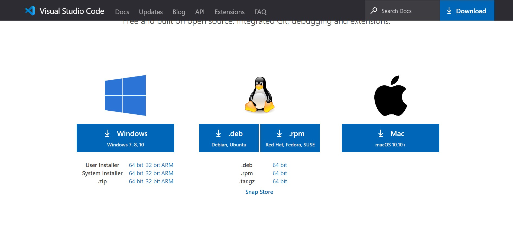

# $\mathrm{\TeX}$, $\mathrm{\LaTeX}$ の導入・環境設定

## 概要
$\mathrm{\TeX}$という文書を作成するツールがあります。
これをインストールして環境設定するところまでいきたいと思います。

今回はTeXLive2020とVScodeをインストールしてVScodeでLaTeXをできるようにするところまで行きたいです。

この導入のしかたは [VSCodeで最高のLaTeX環境を作る](https://qiita.com/Gandats/items/d7718f12d71e688f3573) を参考にしています。

## ゼミの流れ
二回にわけて導入したいと思います。
(TeXLive2020のインストールに時間がかかるため)
### 第一回
TeXLive2020・VScodeのインストール
VScodeの設定
### 第二回
VScodeにLaTeXを導入する

## 必要なもの
- Windows10 or Mac or ...
- 根気

## やり方
### 第一回
### VScodeの導入
公式インストーラーからインストールします
https://code.visualstudio.com/download
このリンクを開くと、下のような画面が出てくると思います。

